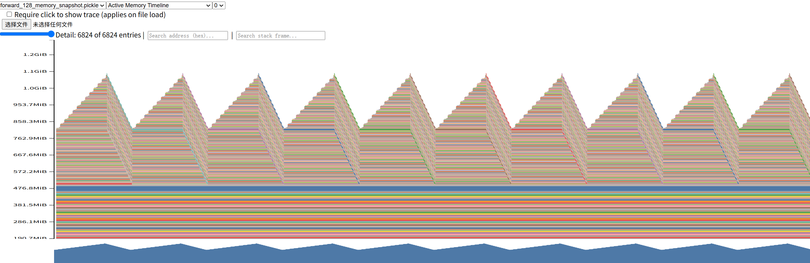
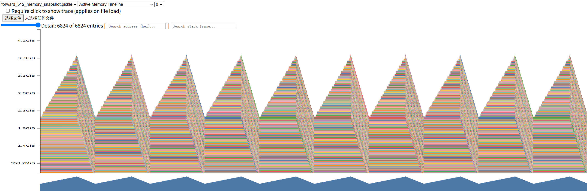
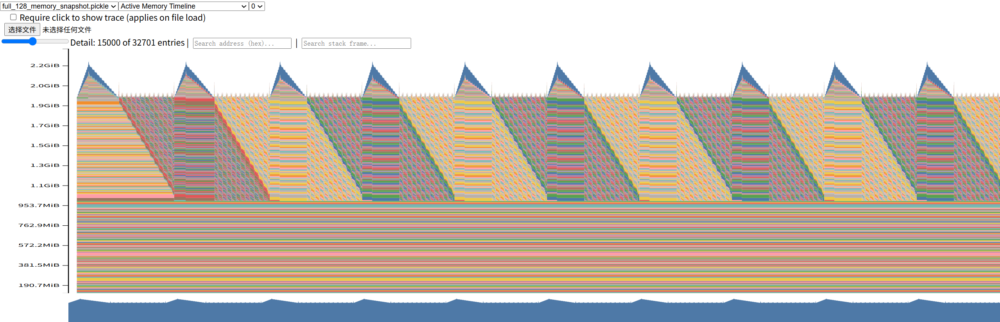
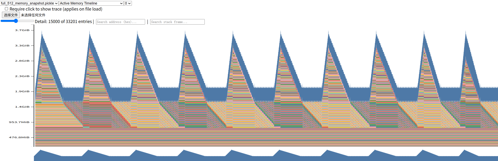
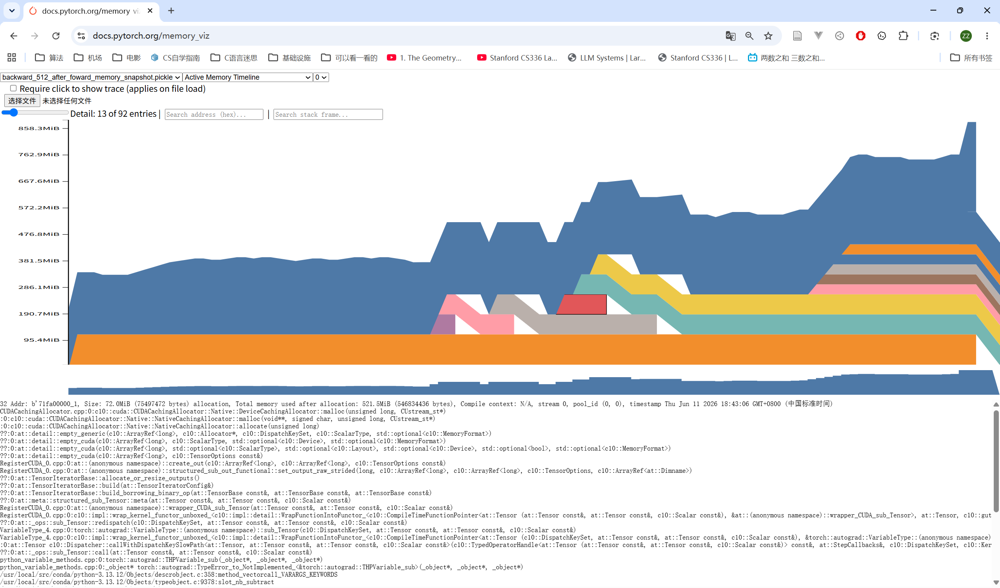
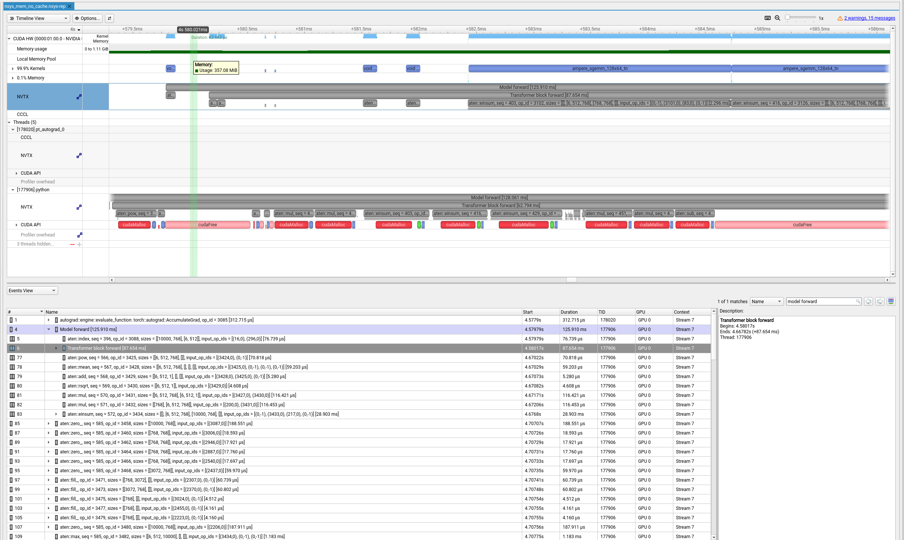
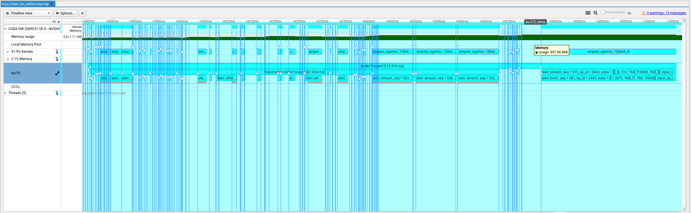

### Problem (benchmarking_script)

(a) 完整的脚本创建在了 **cs336_systems/benchmarking_script.py**

(b) 在 5次 warm-up 10次执行的参数下，前向的平均用时是 1.9s，然而前向加上反向的平均用时却是 1.4s，
	对于前向的用时而言，标准差高达 1.2。而对于前向加上反向用时的标准差只有0.002。

``` C++
** with 10 warmup **

$ python cs336_systems/benchmarking_script.py --d_model 768 --d_ff 3072 --num_layers 12 --num_heads 12 --mode forward
Average use 1.9237 s for forward mode. Best 0.6747 s. Worst 3.1956 s
std 1.2340

$ python cs336_systems/benchmarking_script.py --d_model 768 --d_ff 3072 --num_layers 12 --num_heads 12 --mode backward
Average use 1.4637 s for backward mode. Best 1.4606 s. Worst 1.4676 s
std 0.0020
```

forward only过程中，相邻的两次测试时间差别很大，总体的标准差超过1，具有很大的变化性。而 forward + backward 则与之相反，总体稳定

(c)
```C++

**without warmup**:

$ python cs336_systems/benchmarking_script.py --d_model 768 --d_ff 3072 --num_layers 12 --num_heads 12 --mode forward
Average use 1.3787 s for forward mode. Best 0.4574 s. Worst 2.2548 s
std 0.8856

$ python cs336_systems/benchmarking_script.py --d_model 768 --d_ff 3072 --num_layers 12 --num_heads 12 --mode backward
Average use 1.3366 s for backward mode. Best 1.2925 s. Worst 1.7247 s
std 0.1364
$ 


**with 1 warmup**

$ python cs336_systems/benchmarking_script.py --d_model 768 --d_ff 3072 --num_layers 12 --num_heads 12 --mode forward
Average use 1.6529 s for forward mode. Best 0.4563 s. Worst 3.8520 s
std 1.1537

$ python cs336_systems/benchmarking_script.py --d_model 768 --d_ff 3072 --num_layers 12 --num_heads 12 --mode backward
Average use 1.2944 s for backward mode. Best 1.2934 s. Worst 1.2959 s
std 0.0008
$ 
```

从实验结果来看，似乎进行0~10次的warmup在当前的实验环境下似乎没有任何影响。经过观察发现，实现设置的默认的batchsize=4临近了我笔记本的6G内存，所以在前向中不停的有显存的释放和申请，导致出现了交替情况，当我调小batch_size后，实验现象开始正常。


调整batch_size为1后，重新进行实验，实验结果如下：

(b)

```C++

** with 5 warmup **

$ python cs336_systems/benchmarking_script.py --d_model 768 --d_ff 3072 --num_layers 12 --num_heads 12 --mode forward
Average use 0.2200 s for forward mode. Best 0.2193 s. Worst 0.2227 s
std 0.0010
raw test time list: [0.21941834600011134, 0.2194550760000311, 0.21928603699961968, 0.2201396069999646, 0.21932191399992007, 0.21965661800004455, 0.2197763499998473, 0.22274655000001076, 0.22024441600024147, 0.21966353099969638]

$ python cs336_systems/benchmarking_script.py --d_model 768 --d_ff 3072 --num_layers 12 --num_heads 12 --mode backward
Average use 0.6967 s for backward mode. Best 0.6955 s. Worst 0.6974 s
std 0.0006
raw test time list: [0.6960806980000598, 0.6967640709999614, 0.6955453829996259, 0.6974438990000635, 0.6962971539996943, 0.6961692869999752, 0.6974262120002095, 0.6972407420003037, 0.6965644910001174, 0.6967358420001801]
$ 
```
实验结果符合常理，forward only和 forward + backward 的测试时间的std都在合理范围内，且后者的时间大于前者。


(c)

```C++

** Without warmup **

$ python cs336_systems/benchmarking_script.py --d_model 768 --d_ff 3072 --num_layers 12 --num_heads 12 --mode forward
Average use 0.2559 s for forward mode. Best 0.2193 s. Worst 0.5807 s
std 0.1141
raw test time list: [0.5806697549996898, 0.22076591799987, 0.2197109020003154, 0.21998632700024245, 0.2193049309998969, 0.2193001429996002, 0.21965150999994876, 0.21949218600002496, 0.22039300899996306, 0.2195825390003847]
$ python cs336_systems/benchmarking_script.py --d_model 768 --d_ff 3072 --num_layers 12 --num_heads 12 --mode backward
Average use 0.7505 s for backward mode. Best 0.6962 s. Worst 1.2313 s
std 0.1690
raw test time list: [1.2313440640000408, 0.6974222510002619, 0.6978611859999546, 0.6962005320001481, 0.6967244339998615, 0.6971803270002965, 0.696748806999949, 0.6966034769998259, 0.6975073640001028, 0.6972350410001127]
$ 

```
当没有进行warm up的时候，似乎总是第一个轮次需要较长的时间，然后第二次开始稳定和有warmup的实验结果一致。
第一次启动需要CUDA 去做某些初始化的操作，一旦这些初始化操作完成后，后续的操作可以继续复用这个初始化过的内容，从而避免了启动开销。


```C++
** with 1 warm-up **

$ python cs336_systems/benchmarking_script.py --d_model 768 --d_ff 3072 --num_layers 12 --num_heads 12 --mode forward
Average use 0.2201 s for forward mode. Best 0.2194 s. Worst 0.2211 s
std 0.0006
raw test time list: [0.22114538400001038, 0.21972069599996757, 0.22088610300033906, 0.21954464800001006, 0.21954085099969234, 0.22034616699966136, 0.2203274080002302, 0.21942798200052493, 0.2194376879997435, 0.2196273650006333]

$ python cs336_systems/benchmarking_script.py --d_model 768 --d_ff 3072 --num_layers 12 --num_heads 12 --mode backward
Average use 0.6972 s for backward mode. Best 0.6958 s. Worst 0.6981 s
std 0.0009
raw test time list: [0.6981472439993013, 0.6979450750004617, 0.6964933270000984, 0.6980083950002154, 0.6971282539998356, 0.6961520089998885, 0.6967132030003995, 0.6970286050000141, 0.6958266399997228, 0.6980490019996068]
(cs336-systems) (base) hniii98@ZKH:~/project/cs336/assignment2-systems$ 
```
当加上1次warmpup后，测试的时间和刚开始有warmup的测试时间一样，证明了上述结论。


### Problem (nsys_profile)

(a)
```text
根据本机的硬件配置我的参数为：
batch_size=2
context_length=512
vocab_size=10000
d_model=768
num_layers=12
num_heads=12
d_ff=3072
```

前向的耗时为 200ms, 与脚本测试中得到的数值一致。

(b)

segmm_128x64_tn在前向中占用了最多的时间，在多次前向中累计共占用72%的总时间。在一次前向中，这个kernel一共调用了85次。在同时进行前向和后续的测试中，仍然是这个kernel占用的了最多的时间, 只不过占比降到了40%。

(c)

加法乘法除法算子以及where和reduce算子。

(d)

在一个完整的AdamW step中，segmm_128x64_tn占比进一步下降到20%，同时 segmm_128x64_nn 和 segmm_128x64_nt分别占比19%和15%。其他的算子基本不变。

(e)

在一个forward pass中，通过使用nvtx的标记可以看出，softmax operation占用的时间为 matrix multiplication 所占用的时间的两倍。

softmax的FLOPs 约为**4BS^2**, matrix multiplication的FLOPs约为**4BS^2D**。softmax的访存强度约为**32BS^2 + 16BS**, 然而matrix multiplication的访存强度为**8BS^2 + 16BSD**，相比之下，softmax的访存强度是matrix multiplication的4倍。
计算下来，softmax的计算强度约为 0.125, matrix multiplication的计算强度约为 D/2，softmax是memory bound而matrix multiplication是compute bound，所以在FLOPs量纲接近的两个算子之间runtime相差了一倍。


### Problem (mixed_precision_accumulation)

FP32相较于FP16有着更大的的位数，因此对于近似数有着更精确地表示，所以累加结果更加精确。由于类型提升的存在，后两次的累加其实是等价的，而FP16所包含的误差在类型提升时候会带入FP32。

### Problem (benchmarking_mixed_precision)

(a)

- 模型参数： 		 FP32
- 第一个FFN: 	     FP16
- Layernorm的输出：  FP32 
- predict logic:	FP16
- Loss:				FP16	
- 梯度：			FP32	

(b)

Layernorm的计算均值的和规约的部分对精度敏感，其中规约部分包括求方差、除法、根号、减法。如果换成BF16的话，虽然改善了动态范围，但是精度问题仍然存在，所以依然需要对softmax区别对待。


(c)

仅考虑small size配置上，开始混合精度后，forward pass only 和 forward & backward pass 的耗时都减少了一半。

### Problem (memory_profiling)


*Figure 1. Memory timeline for forward-only execution with context length 128.*


*Figure 2. Memory timeline for forward-only execution with context length 512.*


*Figure 3. Memory timeline for full step execution with context length 128.*


*Figure 4. Memory timeline for full step execution with context length 512.*


memory timeline呈现出三角形，内存峰值的时候通常与attention的计算有关。


(b)

| Context Length | Mode    | Mixed Precision | Peak Memory |
|----------------|---------|-----------------|-------------|
| 128            | forward | No              | 1.1 GB      |
| 128            | full    | No              | 2.2 GB      |
| 512            | forward | No              | 3.8 GB      |
| 512            | full    | No              | 3.7 GB      |


(c)

当采用mixed precision后，显存占用的峰值对应forward only 和 full step在 context length 为 512的设置下，显存减少了10%。

(d)

```text
d_model: 2560	
context_length: 512
batch_size: 2
```

FP32 activation memory size: 10 MiB

(e)

在当前的配置下，最大的内存分配为24 Mib，通过追溯整个栈调用路径可以得知，来自attention操作中的exp操作。

(f)



通过追溯torch.memory dump 的 pickle 文件得到， 在一个单层的 TransformerBlcok中	， 5个贡献最大的op分别是

- attention 计算中的  Q * K
- attention 计算中的  scores 除以 sqrt(dk)
- attention mask实现的torch.where
- softmax 中的取行最大值
- softmax 中的torch.exp

这些操作总共占据了 40%的内存分配量。






对于residual 的 tensord大小, 这里做大概的定性分析，在forward pass中大概申请的了500 MiB的 memroy，在一个forward之后仍然有400MiB的memory为backwardforward保存，所以在forward pass中，80%的tensor data被保存了下来。


